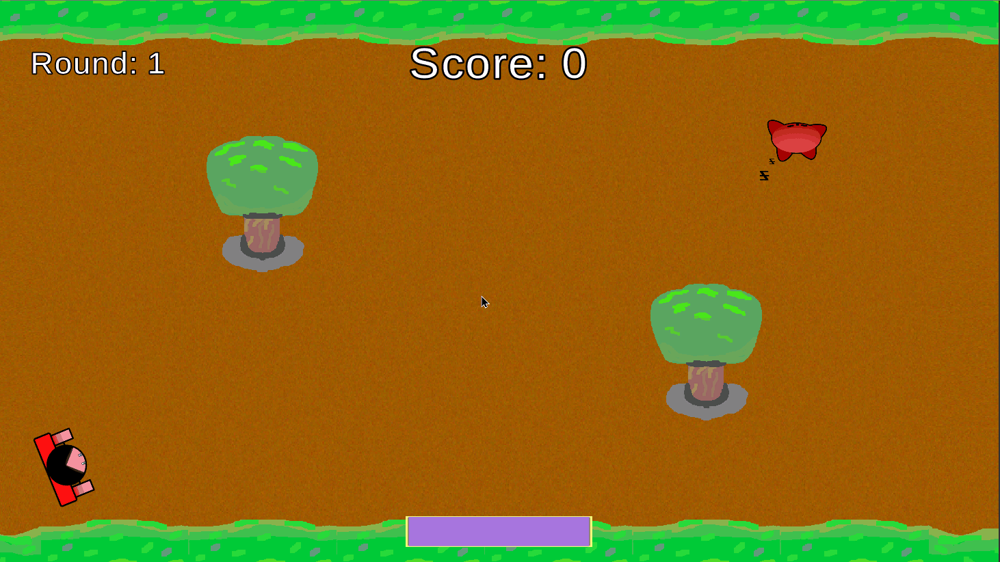
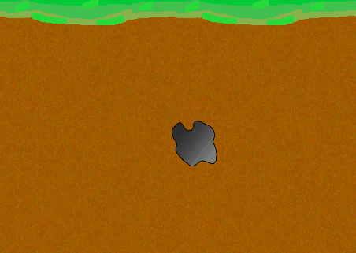

# Enemy Movement
This documentation goes over all enemy movement currently implemented in the game.

## Table of Contents
- [Basic Behavior](#Basic-Behavior)
- [Spawning Pattern](#Spawning-Pattern)

## Basic Behavior
The enemies that are currently implemented have relatively simple AI; they only start attacking and closing in on the player as soon as the player is within range of them. Otherwise they will remain idle.

Enemies have a set firing rate as well; however, note that their bullets will not clash with each others.

## Spawning Pattern
Currently, enemies spawn in waves, with a slight pause in each wave. Depending on how long the player has lasted (which is dictated by the round counter), the faster and more enemies will spawn in each wave. 

Enemy spawns are indicated by a black smoke puff. During this, the player can safely walk through these, but as soon as the enemy emerges, the player will sustain damage.

