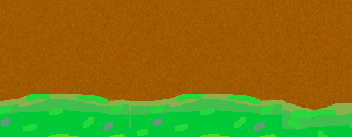
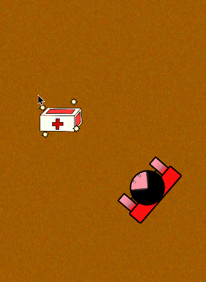

# Gimmicks
This document covers all of the gimmicks that are currently in the game that are not player/enemy specific.

## Table of Contents
- [Healing Items](#Healing-Items)

## Healing Items
These are uncommon drops that spawn during the course of the game. When an item appears, a distinct sound effect will play, followed with the item spawning.

Upon collecting this by the player, the player will recover one point of health, regardless if they needed it or not. Once collected, the item will dissapear forever, until another one spawns in.

> Note: The player can also accidentally shoot and destroy these items as well, so caution must be made!

