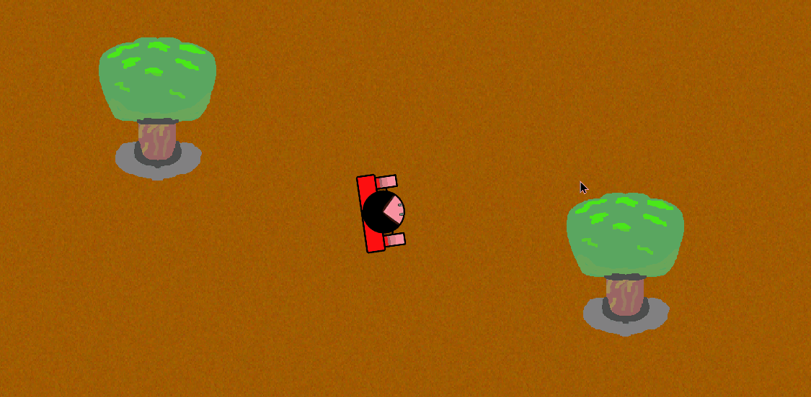
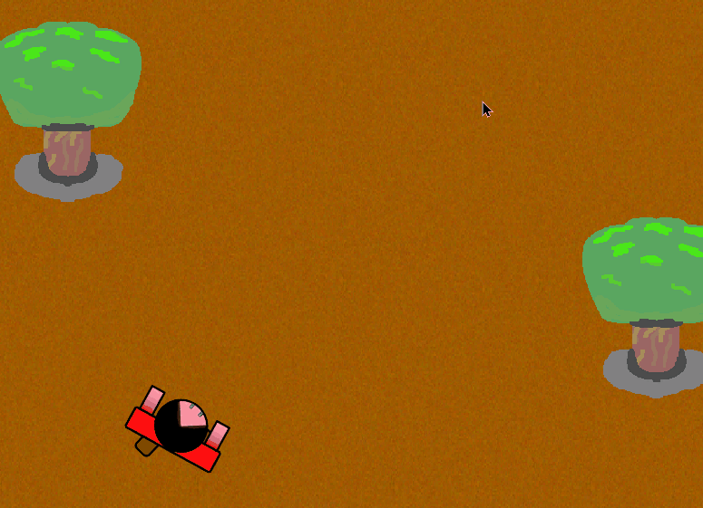

# Player Movement
This document goes over all of the potental moveement options the player has while playing the game.

## Table of Contents
- [Basic Movement](#Basic-Movement)
- [Dashing](#Dashing)
- [Dodging](#Dodging)

## Basic Movement
Besides moving with the WASD, the player also can turn and rotate around a full 360 degrees using the `mouse`. This allows them to reposition themselves to face specific directions, which in turn, leads to full 360 degree shooting.

Shooting can be done by `left-clicking`. This can alternatively be held down to perform rappid fire shots. As of now, the player can shoot for as long as they can, but this sevverely limits the player's movement options to only moving around.

## Dashing
By pressing the `Space` key while moving around, the player will perform a burst dash, moving in the direction that the player is moving towards. While dashing, the player cannot change their direction nor shoot or stop. The player also cannot continuously keep on dashing, there is a small cooldown period in between each dash.

## Dodging
While _not moving_, if the player presses `Space`, the player wwill perform a dodge manuever. During this, the player cannot do any action, unless if an enemy projectile collides with them _while_ performing the dodge. There is a small window to do this, however, and once the window passes, the player is unable to do any movement.

However, if the player does get hit by an enemy projectiile while dodging, the player will activate __slow motion__ (bullet time, slowmo, you get the idea). During this, the player can do _any action_ besides dodging, and all enemies on screen will be slowed down tremendously. While in this state, all points earned are doubled!

The duration of __slow motion__ is dictated by the bar at the bottom part of the screen. Once depleated, __slow motion__ will end and the player will be unable to perform any more dodges until this meter is refilled. This meter will slowly regenerate over time, but it will also refilll faster if the player shoots at enemy projectiles.

### Some Tips!
- While in __slow motion__, the player cannot get hurt by projectiles or enemies.
- By shooting at shot enemy projectiles, the player can _extend_ the duration of the __slow motion__ if it is still active
- Enemies will stop spawning as well as won't be able to attack